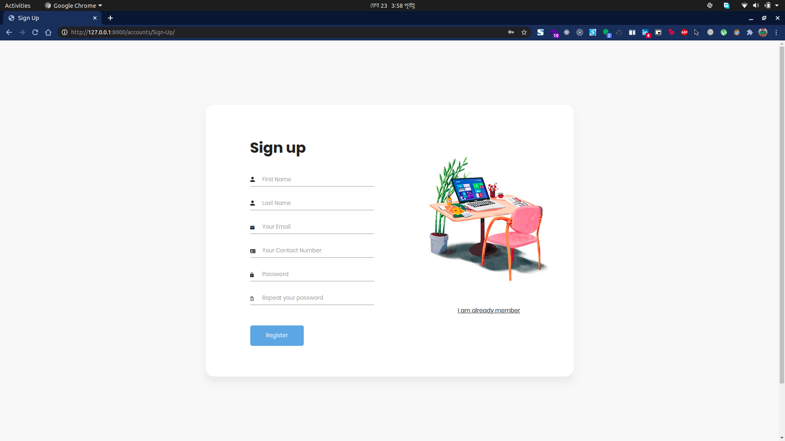

# My Django Snippets
## Custom Login/Signup

In this snippet, I implement a simple function-based yet custom Django SignUp system. 
It creates a profile for a user with first name, last name, email and contact number

## Installation

This snippet only requires Django to run.

Install the dependencies and devDependencies and start the server.

```sh
git clone https://github.com/thedrowsywinger/My-Django-Snippets.git
cd LoginSystem
python manage.py makemigrations
python manage.py migrate
python manage.py runserver
```

In the browser , go to

```sh
http://127.0.0.1:8000/accounts/Sign-Up/
```

## Sign Up




