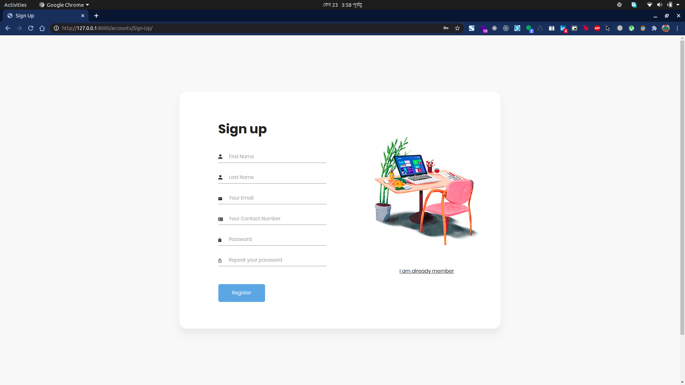
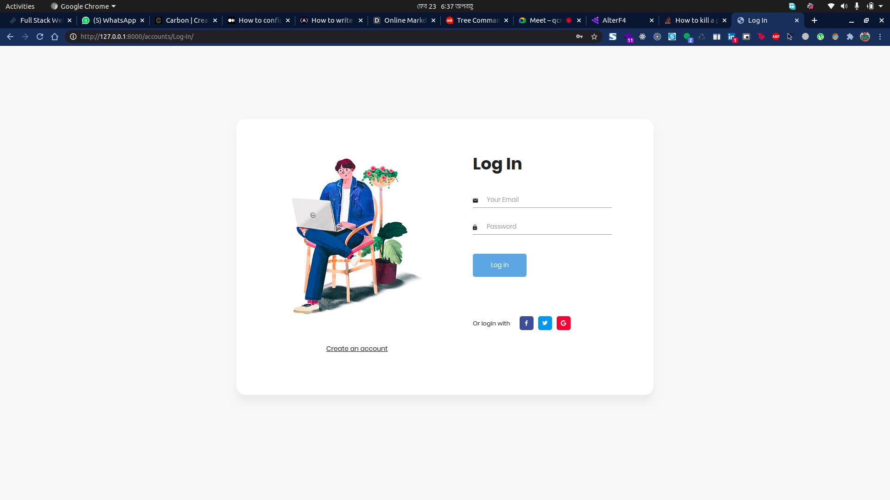
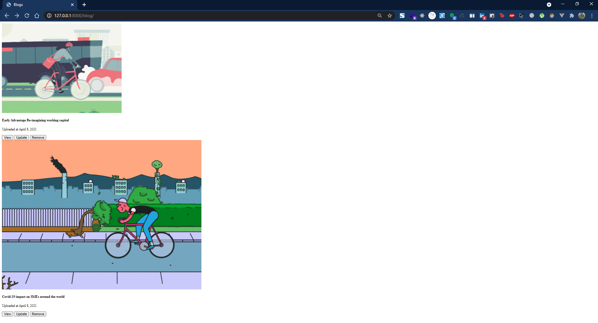
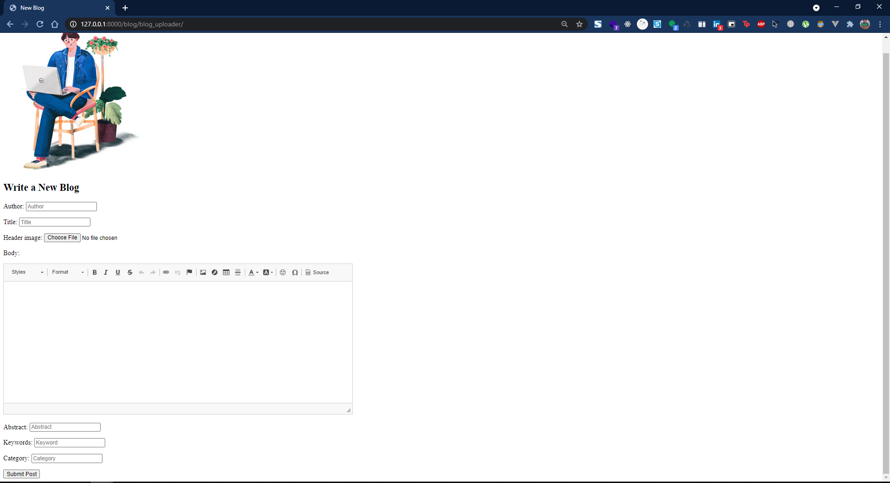
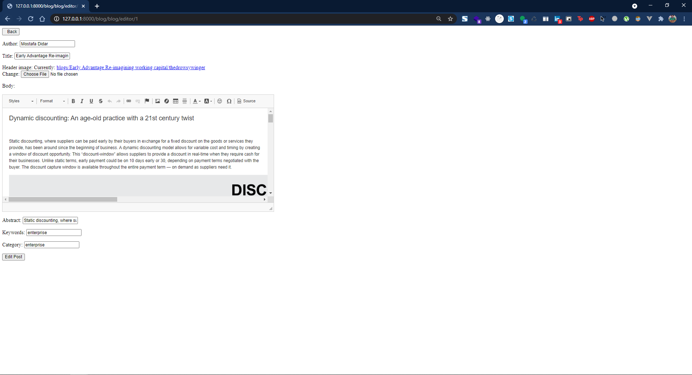

# My Django Snippets
## Custom Login/Signup

In this snippet, I implement a simple function-based, custom Django SignUp system. 
It creates a profile for a user with first name, last name, email and contact number

## Installation

This snippet only requires Django to run.


```sh

git clone https://github.com/thedrowsywinger/My-Django-Snippets.git
cd RegularDjango
python manage.py makemigrations
python manage.py migrate
python manage.py runserver

```

In the browser , go to

```sh
http://127.0.0.1:8000/accounts/Sign-Up/
```

## Sign Up




## Log In

```sh
http://127.0.0.1:8000/accounts/Log-In/
```



## Blog

### Blog Gallery

```sh
http://127.0.0.1:8000/blog/
```



### Creating A New Blog

```sh
http://127.0.0.1:8000/blog/blog_uploader/
```



### Editing A Blog

```sh
http://127.0.0.1:8000/blog/blog-editor/3
```



### Removing A Blog

```sh
http://127.0.0.1:8000/blog/delete/3
```

